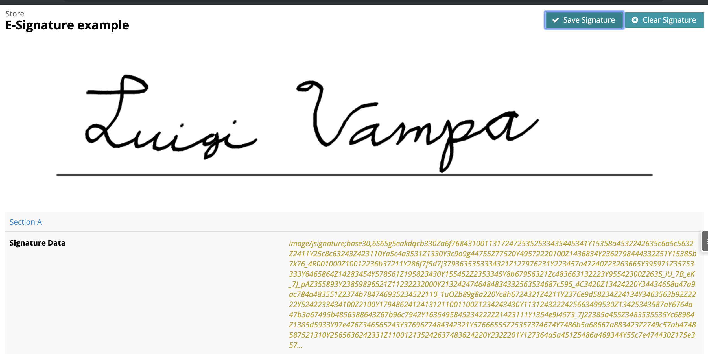
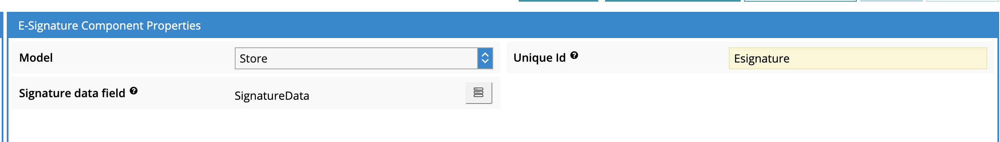
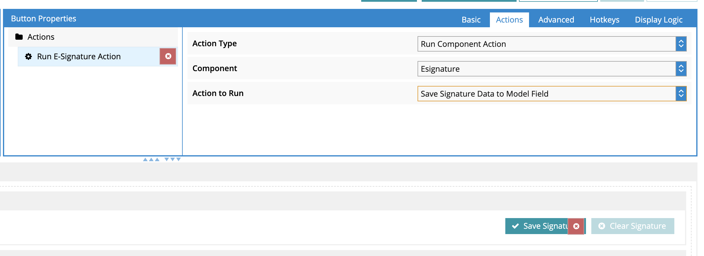
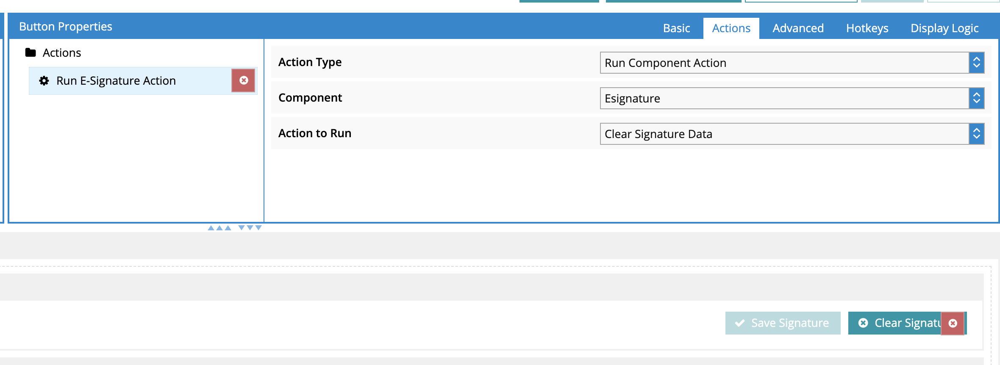

# E-Signature Components

This component pack provides a single "E-Signature" component which enables users to draw a digital signature, and then store that signature data into a text field on a Skuid Model.

## Usage

To use the E-Signature component, you will need to connect it to a Skuid Model with a text / textarea field that is able to hold at least 5000 characters worth of data, preferably. Digital signature data can be extracted from the component by running the "Save Signature Data to Model Field" action for an E-Signature component instance.

This component type exposes two component actions, which can be used to extract or clear the signature data from a given component instance:

 - *Clear Signature Data*: Clears out all signature data stored in the e-signature component, as well as in the component's configured signature data field.
 - *Save Signature Data to Model Field*: Extracts the signature data from the component instance and stores it to the component's configured signature data field.

If there is any data in the configured signature data field in the Model, then when the component is first rendered, that data will be displayed in the component.

## Screenshots

#### Runtime

#### Model Properties

#### Store Signature Data Action

#### Clear Signature Data Action

