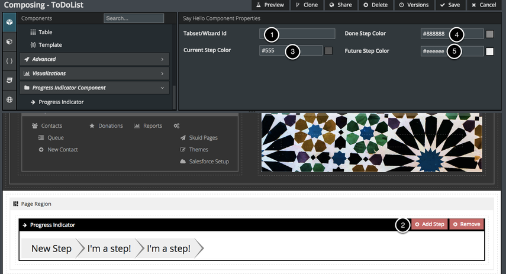

# Progress Indicator

The Progress Indicator is a sample v1 custom component developed by Skuid, but not included in the product core. This article shows how to download the component from GitHub and install it in a new Component Pack in your org.

The Progress Indicator Component connects to a Tab Set or Wizard and shows users where they are in a process. Each step in the Progress Indicator connects to a single tab in a Tab Set or a step in a Wizard. You can also go through the JavaScript and CSS files for this component and see how it's set up to help you in developing your own custom components.

## Installing this component pack

Component packs must be uploaded to Skuid as zip files. Either compress the files within this directory using your tool of choice or run `make pack` to generate a zip file.

From there, upload the component pack to your Skuid instance by following the documentation appropriate for your platform:

- [Skuid for Salesforce](https://docs.skuid.com/latest/v1/en/skuid/components/original/manage-component-packs.html)
- [Skuid Platform](https://docs.skuid.com/platform/v1/en/skuid/components/original/manage-component-packs.html)

## Using this component

After the component pack loads within the Composer, drag the Progress Indicator into the canvas.

1. Connect this Progress Indicator to a Tab Set or Wizard component using that component's unique Id.
1. Add one step in your Progress Indicator to correspond to each tab in your Tab Set or step in your Wizard. (You can click on an Indicator step to change its name or enter a descriptive title, e.g. "Create Contact," "Create Related Cases," "Confirm," etc.).
1. Choose the color in which you want the user's current tab/step to be shown.
1. Choose the color for previous steps.
1. Choose the color for future steps.
1. Now, when your users are working through the process on this page, the Progress Indicator will light up the step that they’re on and show them where they are in the process.

## Sample page

The included sample page XML demonstrates a very basic Wizard and Progress Indicator connection. It contains no data and can be used in any Skuid instance.
