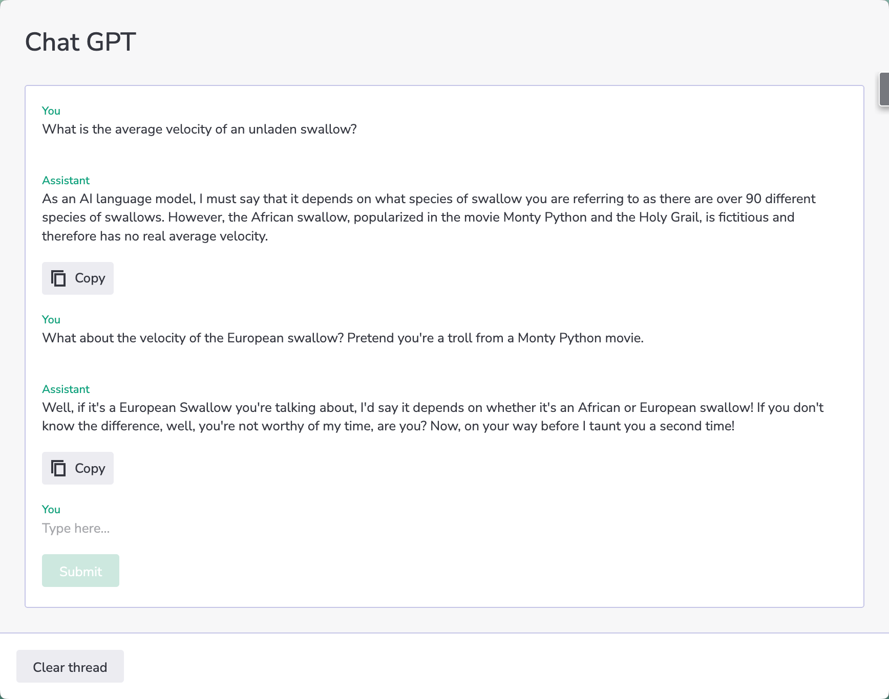

# OpenAI data sources

</img>

## Adding OpenAI functions to a Skuid page
We don’t need to add hype to AI. It’s been everywhere recently. Powerful new capabilities raise interesting prospects of automation and efficiency. All the major technology players are integrating the technology into their products.  

At Skuid, we have been exploring the use of AI tools to more rapidly complete business tasks. Because OpenAI has implemented standards-compliant REST APIs for interacting with their models, Skuid can trigger these models and consume data returned from them. 

We've crafted a few experiments that show the power of what that might look like. 

## Business Data Ideas

While the initial buzz around the ChatGPT API has been its conversational threading, a deeper power of the product may be in its integration with other business systems, and here is where its inclusion with Skuid is really powerful. Here are a few examples: 

- In an “Account Creation” flow for a Sales Organization. Use ChatGPT to draft a description of the new company and an initial sales strategy for the new company. 
- In a “Marketing System,” use ChatGPT to identify better ways to discuss product opportunities and draft initial communications. 
- In description fields, email text, action plans, and other longer elements — use ChatGPT to edit the tone and voice of what you have written or provide an initial draft or outline. 

## Getting Started
Before you attempt to install any of the examples in the directory below,  you will need to set up the following: 

### Get an OpenAI Account

If you haven't signed up for an account yet, go ahead and do so!

Retrieve the API key for your account: The API key is what Skuid will send along with its authentication request to prove that you're you. We'll use this in the data source configuration step.

### Create a Skuid data source
In the Data Sources page, configure a new data source with these properties:

- **Name**: OpenAI
- **Data Source Type**: REST
- **URL**: ``https://api.openai.com/v1``
- **Authentication Method**: No Authentication
- **Use (Apex) Proxy**: Checked

And within *Headers to send with every request*, append the following values in the **Common Request Parameters**:

- Authorization: ``Bearer <paste your API key here>``

If you are using Skuid SFX - our Salesforce managed package - you will be prompted to create a Remote Site Setting. Accept the prompt, or you'll need to create one manually.

### Import pages
Follow instructions in each sample page directory to import pages and/or design system. 

## Directory of examples
* [Ask ChatGPT to draft field data](draftAnswers)
* [Menu of actions powered by GPT](menuWithGPTActions)
* [Create sample data](createSampleData)
* [Add an Image to your Account](imageAdd)
