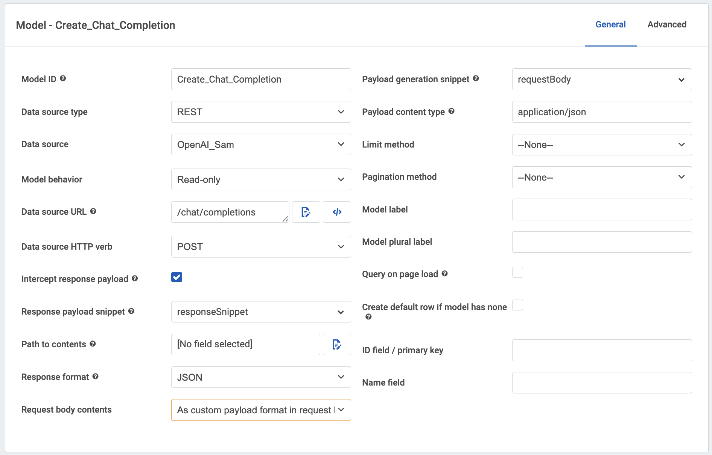

# Ask ChatGPT to draft answers in your forms. 
 
 This sample page shows how the ChatGPT API can help draft field values for any data you manage with Skuid. The application uses a Skuid action sequence that uses information from a record to create a prompt that is sent to ChatGPT.  The user can review the resulting response and iterate on the responses provided by the AI Engine. Finally the output  is copied into the specified field in your application.  The generic nature of the application means it can be bound to any field in your application and will return the output to the correct place. 

## Instructions
- Page API:  V2
- Data source: REST data source named "OpenAi" connecting to your OpenAI instance per [instruction](openAI)
- Design system: None 
- Page XML:  [Copy the XML from this page](UpdateAnyField_w_ChatGPT.xml?raw=true), or save it as an XML file, and upload it as a new page in Skuid's Pages.

## Notes

### Models:  

The application uses 2 sets of models. 

The first three models represent Business Object you might find in your CRM.  For the sake of this demo they are UI Only models,  but you might be creating new Salesforce records, or new survey questions in a Postgres table etc.  

The second set of models are used for the Chat function. 

1.  UI Only “Chat Thread Display” model. 
This model will show the output from the ChatGPT interaction and hold the full thread of the discussion. 

2. REST model for interacting with ChatGPT. 
This model will handle the communication with the Chat Engine. 

</img>


### Snippets: 
Two snippets are required for interacting with this data source. 

1. Request body construction snippet. 

This snippet creates the request body in the format necessary for submitting to the OpenAI API. 

- Resource type:  Generic JS Snippet
- Snippet name:  requestBody
Code: 

```
const params = arguments[0];


// Get the skuid model
var chat = skuid.$M('Chat_Thread').dataMap;
console.log(chat)


// Create array to store values
var messages = [];


// Loop through each row in the model
Object.entries(chat).forEach(([key, value]) => {
  console.log(value.content);


   // Push object into the array
   messages.push({content:value.content, role:value.role});
  
});


//Create response body
let body = {
 model: 'gpt-3.5-turbo-0301',
 messages: messages
};
```

return body


2.  Response parsing snippet. 
This snippet intercepts the return from ChatGPT and adds it as a new row to the Thread Display model. 

- Resource type:  Generic JS Snippet
- Snippet name:  responseSnippet
Code: 

```
const params = arguments[0],
   message = arguments[0].response.body.choices[0].message;


//Get chat thread model
var chat = skuid.$M('Chat_Thread');


//Take the returned message and append it to the chat thread
var addResponse = chat.createRow({
   doAppend: true,
   additionalConditions: [
       { field: 'content', value: message.content },
       { field: 'role', value: message.role }
   ]
});


//Append an additional blank row to the chat thread
var newChatRow = chat.createRow({
   doAppend: true,
   editModeForNewItems: true
});
```


### Generic Action Sequences. 

Note that the button on each form calls the same Action sequence.  But different inputs are passed into the action sequence to indicate what Model and field is to be updated,  and what the initial prompt should be.   These inputs are carried through into a second action sequence that returns the Chat Response into the appropriate field. 
