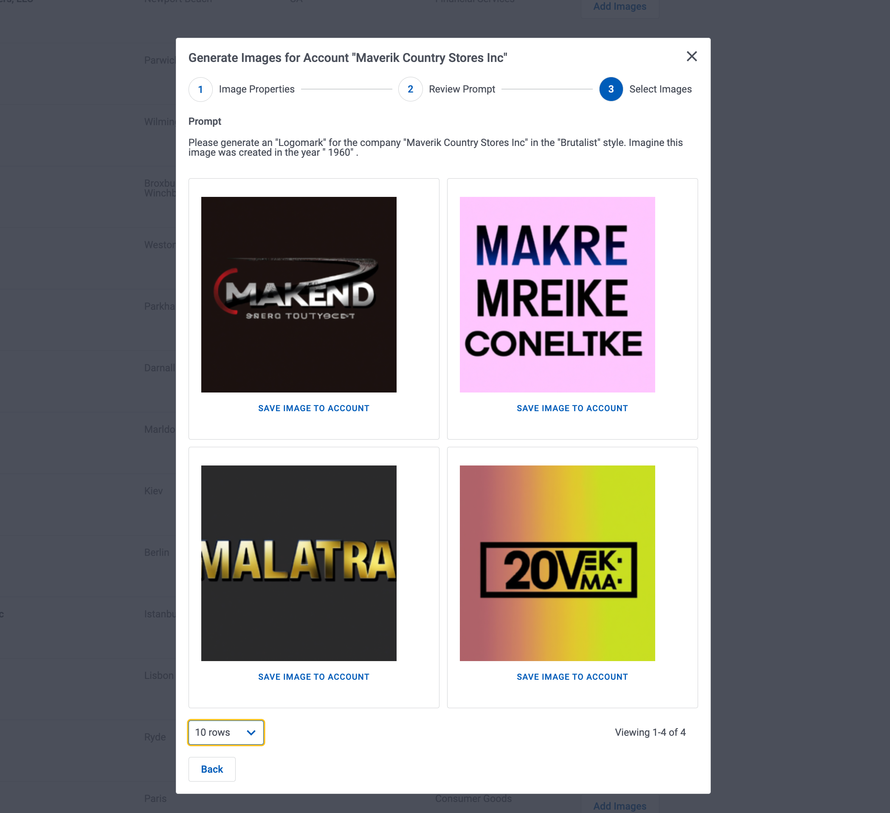

# Ask DALL-E to generate sample images for your business records 
 
</img>

This sample page shows how the Dall-e API can be used to create images that are associated with data from your business records. The application allows the user to create a prompt that includes data from an account record. The prompt can be adjusted and then submitted to the image generation API.  4 images are returned.  The user may select one, and it will be saved to a Salesforce attachment record,  connected to the account record using Skuid's "File" custom sObject.  

## Instructions
- Page API:  V2
- Data sources: 
    - Salesforce data source.  (Account object,  Attachment object,  Skuid_Image__c object)
    - REST data source named "OpenAi" connecting to your OpenAI instance per [instruction](openAI)
- Design system: None 
- Page XML:  [Copy the XML from this page](AI_Image_Generation.xml?raw=true), or save it as an XML file, and upload it as a new page in Skuid's Pages.

## Notes

### Models

1.  Salesforce Accounts. 
This model shows a list of Salesforce Accounts.  It also uses the Skuid File object to create a lookup from the account record to an Attachment record.  For more information about that feature - [see this tutorial](https://docs.skuid.com/latest/en/tutorials/salesforce/add-images.html).

2.  UI Only “Prompt Generation” model. 
This model is used to hold the Prompt,  and has a number of additional fields with pick lists and text entry to enrich the prompt (style, image category,  year created). 

3. REST model for performing "Image Request". 
This model handles the communication with the API. 
The core of the interaction is handled in a POST Body that is created as a template. 

NOTE: You will get errors in the builder because Skuid will attempt to execute the POST in order to get field metadata and because of merge syntax in the template,  this will not be successful.  This means that configuration of `Route to Contents` and `Fields` must be done manually in the page XML. 

4. Several models for handling the "Image Save" process.
Three final models handle the process of saving an image to a new Salesforce Attachment record,  creating a new "Skuid_Image__c" record (which is a junction object) and updating the Account in context.  

### Miscellaneous

1. The prompt is constructed in an `Update Row` action that uses a `JOIN TEXT` formula function to pull together field values from the UI model, and from the account model and update the `Prompt` field.  This allows the prompt field to still be editable after this initial update in case the user wants to add more detail to their prompt. 

2. The Image API returns the images as a `base64 object`.  This type of image can be displayed using the following HTML syntax ``   

3. The "Save Image to Account" action sequence is pretty extensive.  It creates 2 new records,  passing the `base64 object` into a Salesforce Attachment.  It updates an Account detail record and then updates the primary Account List model so the newly saved image is shown in the lst.  Powerful stuff.
