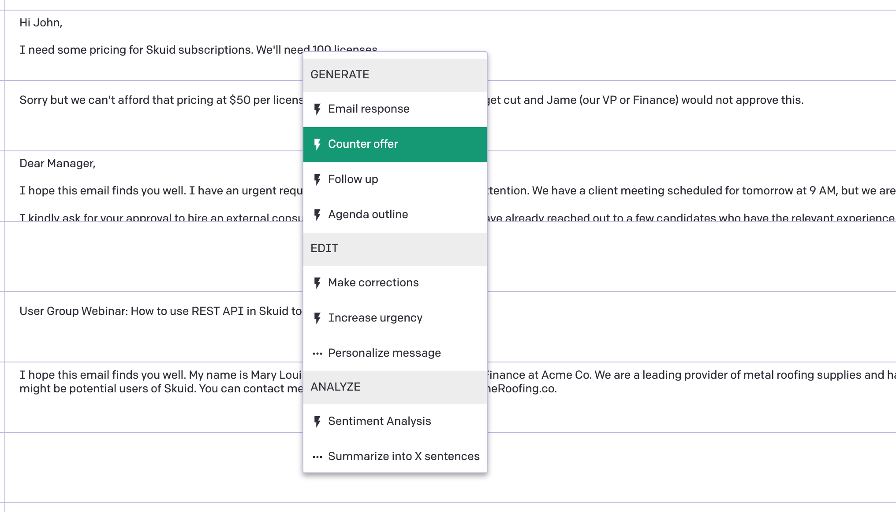

# Reusable Action Sequence: A menu with actions powered by GPT 
 
This sample page shows how you can provide a list of actions for your users in the form of a right-click menu. These actions are pre-built prompts to help your end users make good requests to the OpenAI's `gpt-3.5-turbo-0301` model. These actions can be grouped in categories like Generate, Transform, or Analyze. 

Actions with the Lightning icon will send a POST request to OpenAI immediately, while actions with the Horizontal Dots icon will require some extra information before sending the request. You can add context to the prompt using the Search component that can be configured to search standard or custom Salesforce objects.

The sample page uses Task object from Salesforce but that's just an example. You can configure the action sequence to be connected to any object or data source. 

</img>

## Instructions
- Page API:  V2
- Data source: REST data source named "OpenAI" connecting to your OpenAI instance per [instructions](../)
- Design system: This Demo uses the ChatGPT_Demo design system. [Download this Design System file](../ChatGPT_Demo.designsystem) and use the Import function on the Design System page to add this system to your org. 
- Page XML:  [Copy the XML from this page](MenuWithGPTActions.xml), or save it as an XML file, and upload it as a new page in Skuid's Pages.

## Notes

### Models

The application uses 2 sets of models. 

The two task models use the standard Salesforce Task object.  You could replace these models with any data object you have connected in Skuid.  

The Salesforce data source is also used as a source for the search box in the sidebar. 

The second set of models are used for the Chat function. 

1.  UI Only “Chat Thread Display” model. 
This model will show the output from the ChatGPT interaction and hold the full thread of the discussion. 

2. REST model for interacting with ChatGPT. 
This model will handle the communication with the Chat engine. 
