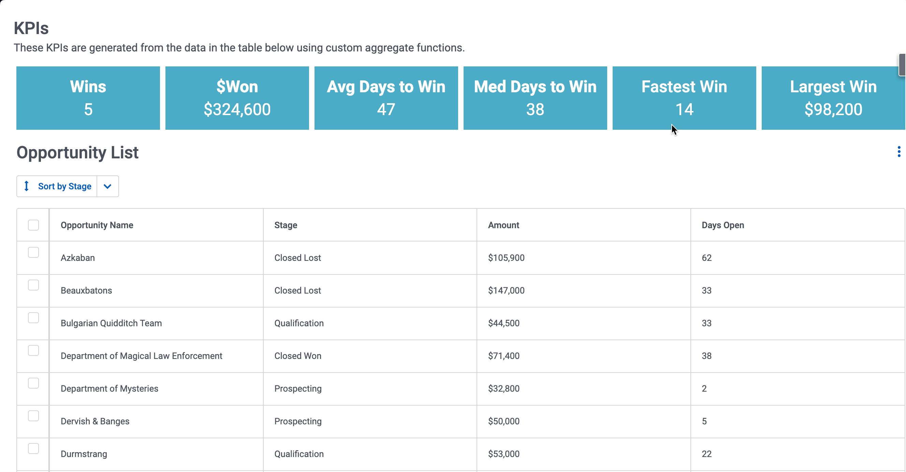
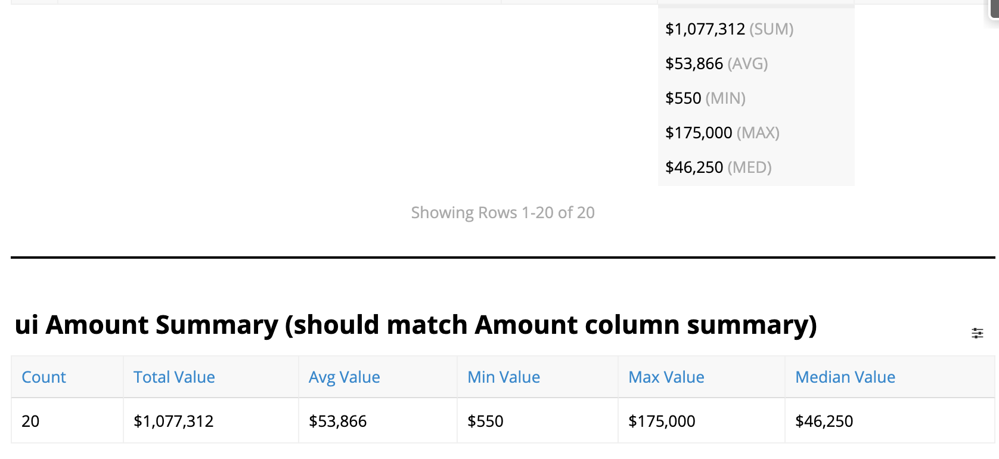
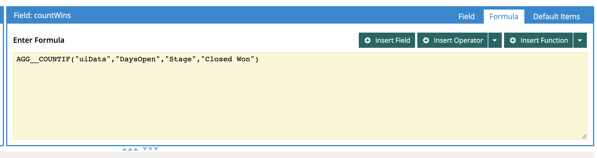

# Aggregation Formula Functions

This folder contains various aggregation functions which iterate over some or all rows in a model and compute an aggregate value, e.g. a count, sum, max, min, average, or median. Many of these functions may be familiar from working in Excel, the main difference being that in Skuid you will need to provide the functions with the name of a Model whose data you would like to aggregate, instead of a range of cells as you would in Excel.

All functions are contained in one JS file because (a) they rely on a common utility function, and (b) this enables the functions to be easily dropped into any Skuid Page via a single inline JavaScript resource.

## Usage

To use these formula functions, you will need to take the `aggregationFunctions.js` file and add it either as a static file in your Skuid Platform site, or as a static resource in your Salesforce site, and then reference this static file/resource as a JavaScript resource in your Skuid Page. Alternatively, you can just copy the contents of this file into an inline JavaScript resource in all Skuid pages where you want to use these functions.

OR, for simplicity, you can import the included example page, [AggregationFunctionsExample.xml](AggregationFunctionsExample.xml) into your Skuid site, and experiment with the functions there! Screenshots of this page are included below to give you an idea of what it provides.

## Function Index

Here is an index of all functions contained in this file:

  - AGG__SUM(modelToAgg, fieldToAgg, countblanks)
  - AGG__SUMIF(modelToAgg, fieldToAgg, conditionField, conditionValue, countblanks)
  - AGG__AVG(modelToAgg, fieldToAgg, countblanks)
  - AGG__AVGIF(modelToAgg, fieldToAgg, conditionField, conditionValue, countblanks)
  - AGG__MIN(modelToAgg, fieldToAgg, countblanks)
  - AGG__MINIF(modelToAgg, fieldToAgg, conditionField, conditionValue, countblanks)
  - AGG__MAX(modelToAgg, fieldToAgg, countblanks)
  - AGG__MAXIF(modelToAgg, fieldToAgg, conditionField, conditionValue, countblanks)
  - AGG__COUNT(modelToAgg, fieldToAgg, countblanks)
  - AGG__COUNTIF(modelToAgg, fieldToAgg, conditionField, conditionValue, countblanks)
  - AGG__MED(modelToAgg, fieldToAgg, countblanks)
  - AGG__MEDIF(modelToAgg, fieldToAgg, conditionField, conditionValue, countblanks)

## Screenshots

#### Runtime

#### Composer

