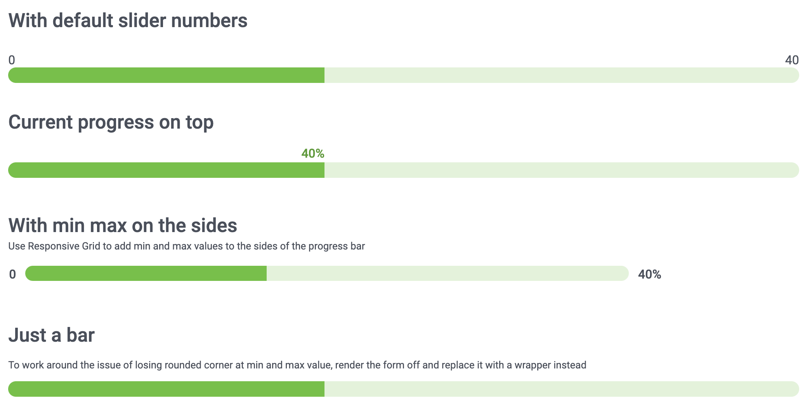
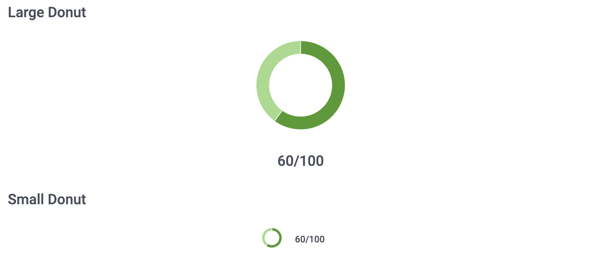
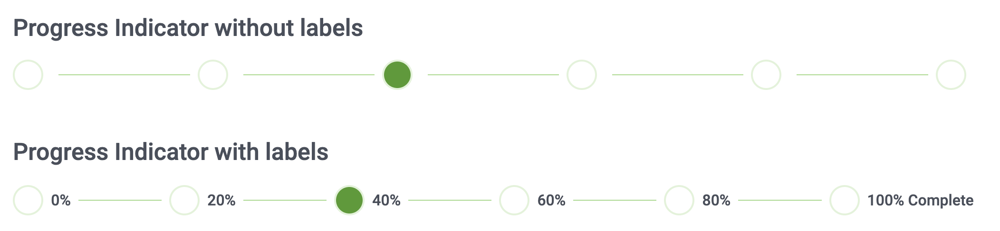

# Utilize existing Skuid components for progress bar
Build a custom progress bar or progress indicator with existing Skuid components like Form, Chart, and Wizard. 

## Form with a number input displayed as Slider
</img> 

A creative and simple way to re-create a progress bar in Skuid using the Form component and a UI-only number field displayed as Slider that gets updated manually. Use [sliderInputProgressBar.xml](sliderInputProgressBar.xml) to check out this solution.

## Donut chart
</img>

Use [donutChartProgressBar.xml](donutChartProgressBar.xml) to see how you can manipulate a donut chart into a circular progress bar.

## Wizard
</img>

More like a progress indicator than a progress bar, use Wizard component step labels to show the user how far along in the process the current step is. Use [wizardProgressIndicator.xml](wizardProgressIndicator.xml).

## Usage
Note: These examples use a UI-only model for dummy data, so they should work in any Salesforce org or Skuid site without any data sources.

1. Import the [SliderProgressBar.designsystem](SliderProgressBar.designsystem) design system into Skuid environment.
2. Create a new Skuid page and paste/upload the XML file.
3. Preview.
