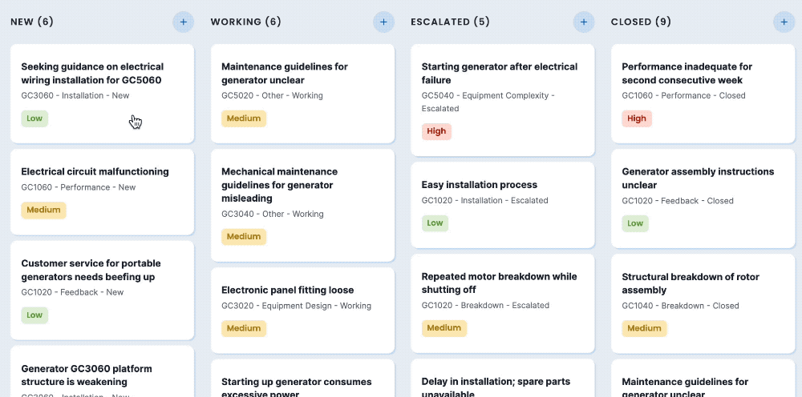
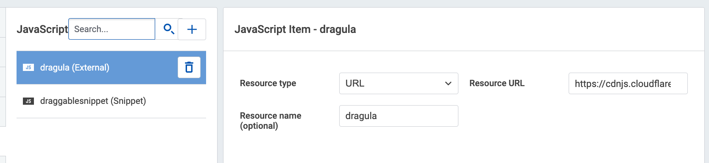
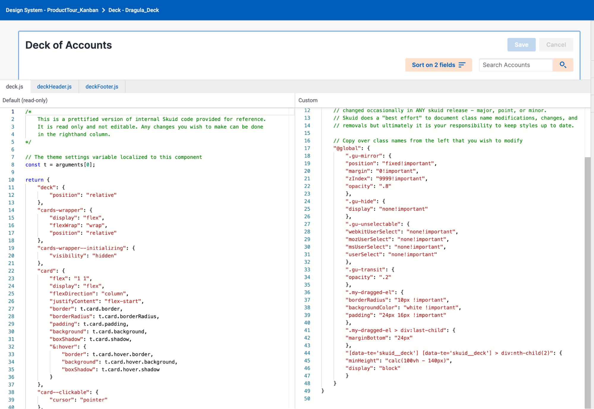

# Drag and Drop in V2 Pages

</img>


We’re exploring how to add “drag and drop” functionality to a Skuid page using a popular third-party JS library, [Dragula](https://bevacqua.github.io/dragula/). This light weight JS library has over 21k stars on Github and doesn’t use jQuery or other bloated frameworks. 

Once the library is added, the Skuid builder can write JS to turn any data displaying components (Table, Deck, List) in Skuid into “drag and drop” mode. 

## Install this example
- Page API:  V2
- Data source: Uses default Salesforce data source  (Cases)
- Design system: Download [ProductTour_Kanban](ProductTour_Kanban.designsystem?raw=true) and import it to Skuid's Design Systems.  
- Page XML:  [Copy the XML from this page](kanban_dragula.xml?raw=true), or save it as an XML file, and upload it on the Skuid Pages page.  


## Approach

### Step 1:  External JS Resource
Create an `external` JS resource to reference the dragula library.  
The URL should be:  https://cdnjs.cloudflare.com/ajax/libs/dragula/3.7.3/dragula.min.js

</img>


### Step 2: Create a Generic JS snippet

A second javascript resource of type `Generic JS snippet` will handle “drag and drop” functionalities in the page.

In this snippet, you can:

- Select the component you want to add dragula to.  (we use a deck with Id: `outside_deck`) 
- Make changes when the item is “dropped” into a new position. In the example linked here, we’re changing the status of the case when dropping it to a new status column. 

Below find the snippet code. 
```
setTimeout(() => {
    const topDeck = skuid.$C("outside_deck"),
        childDecks = topDeck.getChildComponentsOfType("skuid__deck"),
        childEls = childDecks.map(deck => deck.getElement().children[1]);
    //console.log(childEls);
    dragula(
        childEls,
        {}
    )
        .on('dragend', (el) => {
            el.classList.remove('my-dragged-el', 'sk-page');
            el.style.minWidth = '100%';
        })
        .on('drag', (el, source) => {
            el.classList.add('my-dragged-el', 'sk-page');
            el.style.minWidth = `${source.offsetWidth}px`;
        })
        .on('drop', (el, target) => {
        //    console.log(el)
        //    console.log(target)
        //    console.log(target.closest('[data-key]'))
            const id = el.dataset.key.replace('card-', '');
        //    console.log(target.closest('[data-key]').dataset)
            const status = JSON.parse(target.closest('[data-key]').dataset.key.replace('card-', '')).status;
            const payload = {
                status: status,
                id: id,
            }
        //    console.log('publishing payload', payload, 'to update-status');
            const casesModel = skuid.$M('Cases')
            const row = casesModel.getRowById(id);
            casesModel.updateRow(row, { Status: status });
            // casesModel.save();

        //    const casesAggModel = skuid.$M('Cases_Agg_By_Status');
            // casesAggModel.load();
        });
    console.log('loaded draggable');
}, 50)
```

### Step 3: Add styling code as JSS in the Design System Studio. 

There are some specific styling code needed to make Drag and Drop really look good. 
These should be added as code to a variant of the deck component. 
(Note - the ability to add code in a design system must be turned on by your Skuid account representative)
After identifying the deck variant - go to the menu at top right of variant and select `Extend with Code`

</img>


Below find the code that should be used. 
```
	// Copy over class names from the left that you wish to modify
    "@global": {
        ".gu-mirror": {
        "position": "fixed!important",
        "margin": "0!important",
        "zIndex": "9999!important",
        "opacity": ".8"
        },
        ".gu-hide": {
        "display": "none!important"
        },
        ".gu-unselectable": {
        "webkitUserSelect": "none!important",
        "mozUserSelect": "none!important",
        "msUserSelect": "none!important",
        "userSelect": "none!important"
        },
        ".gu-transit": {
        "opacity": ".2"
        },
        ".my-dragged-el": {
        "borderRadius": "10px !important",
        "backgroundColor": "white !important",
        "padding": "24px 16px !important"
        },
        ".my-dragged-el > div:last-child": {
        "marginBottom": "24px"
        },
        "[data-te='skuid__deck'] [data-te='skuid__deck'] > div:nth-child(2)": {
        "minHeight": "calc(100vh - 140px)",
        "display": "block"
        }
    }
  
```

## Considerations

A `setTimeout` function is needed to wait for the components to load before initializing dragula  

In this demo,  the position where the item is dropped is for runtime only and is not automatically preserved on refresh. If drag and drop is used for re-ordering, make sure the data updated on drop includes values that update model order - and the include a save action in your “Drop” sequence. 


