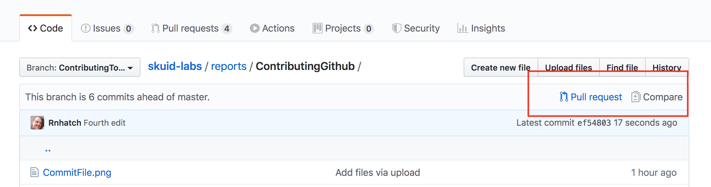

# Contributing to Github using only Github
This document is a step by step tutorial to contribution to Skuid Labs (or other status site generator) using just Github. 

One of the challenges many find to contributing to Github is the infrastructure typically required to do local development and then push changes to the remote repository.  The local copy is a convenience,  and is required if you need to ensure some piece of code works before committing it to the repository.  But in the case of content,  it is not required.  One may work entirely in the remote repository making changes and the daunting infrastructure of a code editor,  terminal commands,  git clients etc can be avoided.  This document shows how one does this work. 

# Instructions

**Step 1.  Go to the SkuidLabs Repo.** 

Remember:  https://github.com/skuid/skuid-labs

**Step 2.  Create a new branch.**
- Open the branch selector button and type name of a new branch (or select the branch you were already working on). 
- Don't try to edit documents in Master.  

</img>

**Step 3. Navigate to the directory where you want to create your new document.**

</img>

**Step 4. Click Create New File button.**

**Step 5. Start typing name of new directory and Readme file.**
- When you type a "/" Github will interpret this as a new directory and expose a new text box.
  - Backspace to get back and edit the directory name
- The first file you create should be  `README.md` 

</img>

**Step 6. Write your document using Markdown syntax.**
- [Here is a helpful document](https://help.github.com/en/github/writing-on-github/basic-writing-and-formatting-syntax) for styling your document using Markdown
- Preview your changes as you work. 

</img>

**Step 7. Commit your changes early and often.**
- Navigate to the bottom of your document 
- Write a commit message
- Select the "commit directoy to the <<branch name>> branch
  
</img>

**Step 8.  After committing - you will have to click edit to keep working.**
- Look for the edit pencil in the title bar for your file. 

### Adding Images and other Files
Commit your Readme file and navigate to the directory your created.   You want to make sure images and other files related to your experiment are in the same Directory as your ReadMe file. 

**Step 9. Click the `Add Files` button and drag files into the big box**

</img>

- After uploading you need to commit these files to your repo.  
- Make sure your commit message is suitably snarky. 

**Step 10.  Edit your Readme file to include relative links to the images you just uploaded.**  
- Like this:  `</img>`
- Upload page xml in the same way 
  - Or create a new file as shown above, with an `.xml` file extension.  
  - Then copy your page xml into that new file. 
- Upload design system zip files in the same way. 

**Step 11.  Rinse and Repeat until you have it just perfect.**
- Commit your work and look it over one last time.
- Makes sure it looks perfect in your branch. 

# Open a Pull Request for review and approval. 
Github provides really good tools for collaborative review and editing.  We use the "Pull Request" mechanism to get this started.

**Step 12. Create a Pull Request**
- Navigate to the directory where all your work is contained. 
- Click "Pull Request" in header bar of the directory. 

</img>

**Step 13.  Fill out Pull Request**

</img>

- How hard can this be? 
- Make sure you are merging `Your Branch` to `Master`. 
  - Github allows for super complex branching, but there is no need to get into all that here. 
- Document what you are trying to do in the title and description.  
  - No need to replicate your document in this description...
- Click the :gear: next to `Reviewers` to request editorial help. 
  - One of these reviewers will need to approve your work before merging to master and making available to the world. 
- Click `Create Pull Request`
  - Email notifications will be sent to the reviewers you have requested
  - You can send them gifts as reminders.  $20.00 bills work well.  

**Step 14.  Handle the back and forth.** 
Now the Pull Request is in play and you'll go back and forth with the editors. 
- Use the "Pull Requests" link at the top of Github to see all the ones you have outstanding. 

</img>

The reviewer will comment generally,  or will highlight specific areas of your code that needs to be improved. 
- You will get an email when they have commented.  
  - Or Just check your Pull Request.  
  - Icons in the list will indicate when there have been comments or approvals. 
- Adjust your code as requested by your reviewer. 
  - You can sometimes accept reccomendations directly in the pull request conversation and commit changes there. 
  - Other times you need to edit your code in the directory and commit it again. 
- All this change history shows up in the Commits Tab. 

</img>

**Step 15. Glorious Approval!!** 
When your reviewer has approved your new article you will get an email,  or you will see the status change in the PR list. 
- Your Job is not Done! 
- At the bottom of the Pull Request screeen look for the "Squash and Merge" button.
  - Add a final commit message with a basic description of the project
  - Confirm the merge
- After merging make sure you Delete your original branch 

Celebrate your contribution to our code repository.  :tada: :tada:
