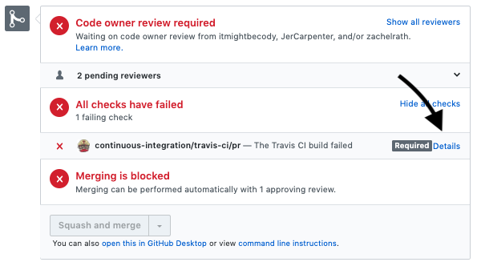
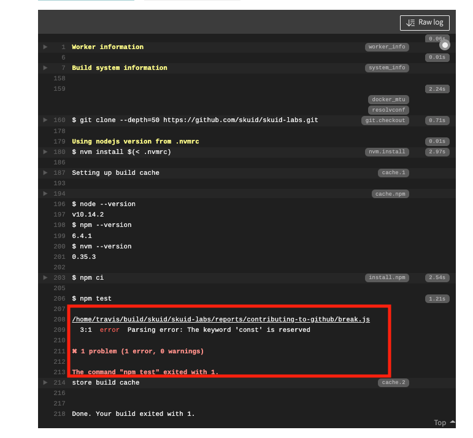

# Contributing to Github using only Github

Typically, developers who contribute to a central source code repository like Github have a series of tools required to do local development. However, the tools used for local development (code editors,  terminal commands,  git clients, etc.) can sometimes be an obstacle to submitting work.

Since Skuid Labs consists mainly of READMEs, Skuid pages, and short code snippets, there's often not a need for a complex development setup. And since it's possible to work and submit content entirely through the Github website, we wanted to show people how to submit their ideas faster.

Follow along with the instructions below to learn how to **submit pull requests to Skuid Labs (or other repos) using just your web browser and the Github UI.**

## Instructions

**Step 1. Go to the SkuidLabs repo.**

Remember:  https://github.com/skuid/skuid-labs

**Step 2. Create a new branch or select your existing one.**

Don't try to edit documents in the `master` branch. This is bad practice, and our repo doesn't allow it anyway.

Instead, **open the branch selector button** and type the name of a new branch. You'll see an option to create a new branch if the name you entered matches no existing branches. Of course, you can also select a branch you were already working on.

**Step 3. Navigate to the directory where you want to create your new document.**

**Step 4. Click `Create new file`.**

**Step 5. Start typing name of new directory and README file.**

- You can create the directory for you submission when you create your README file. When you type a forward slash (`/`) Github will interpret this as a new directory, create that directory, and expose a new text box for your file name. Repeat as needed.
  - Backspace to get back and edit the directory name
- The first file you create should be  `README.md`
- Be careful. Once you've created a file, it is difficult to change the directory name.

**Step 6. Write your document using Markdown syntax.**

- [Here is a helpful document](https://help.github.com/en/github/writing-on-github/basic-writing-and-formatting-syntax) for styling your document using Markdown
- Preview your changes as you work.

**Step 7. Commit your changes early and often.**

- Scroll to the bottom of your document.
- Write a commit message.
- Select the `Commit directly to the <<branch name>> branch` option.

**Step 8. After committing - you will have to click edit to keep working.**

- Look for the edit pencil in the title bar for your file.

## Adding images and other files

Commit your README file and navigate to the directory your created. You want to make sure images and other files related to your experiment are in the same directory as your README file.

**Step 9. Click the `Add Files` button and drag files into the big box**

Upload the rest of your experiment or report files from here. Including:

- Sample page XML, as well as any other JS or CSS files, in the same way.
  - Alternatively, create a new file with an `.XML` file extension, and then copy your page XML into that new file.
- Design system zip files
- JavaScript files for custom components, snippets, or formula functions
- CSS files

After uploading you need to commit these files to your repo. Make sure your commit message is suitably snarky.

**Step 10. Edit your README file to include relative links to the images you just uploaded.**

- Like this: ``

**Step 11. Rinse and repeat until you have it just perfect.**

- Commit your work and look it over one last time.
- Makes sure it looks perfect in your branch.

## Linting

For some file types, Skuid Labs uses a **linter** known as ESLint. Linters ensure that code meets certain style guidelines. We try to maintain a certain level of consistency with the code in Labs, so enforce a linter on all pull requests. That means if your code breaks the rules **you cannot merge your pull request**.

But fear not! Our linter outputs exactly what's wrong, in which file and on which line.

To see what went wrong, see if your build passed. Builds run whenever you commit to the branch, and in this case our build just tests your code to make sure it doesn't break the rules. A failed build looks like this:

To see what went wrong, click **Details** where it noted the build failed.

You'll now see the log of that build. Within that log, you'll see what ESLint took issue with.

From there, navigate to the problematic file and fix the issues within the editor. Then create a new commit with your fixes.

This part of the process is easier to do locally, but it's still possible within the browser! Depending on the nature of your code, fixing one thing may uncover another, but such is life.

## Open a pull request for review and approval.

Github provides really good tools for collaborative review and editing. The `pull request` mechanism gets this started. This is a request to the maintainers of this repo to "pull" your code into the `master` branch.

**Step 12. Create a pull request**

- Navigate to the directory where all your work is contained.
- Click `pull request` in header bar of the directory.

**Step 13. Fill out pull request**

- Make sure you are merging `Your Branch` to `master`.
  - Github allows for super complex branching, but there is no need to get into all that here.
- Document what you are trying to do in the title and description.
  - Don't simply copy your README in this description.
- Click the :gear: next to `Reviewers` to request editorial approval.
  - One of these reviewers will need to approve your work before merging to master and making available to the world.
  - Skuid Labs has several code owners who are automatically assigned all pull requests. At least one of those code owners will also need to approve your pull request before it can be merged.
- Click `Create pull request`
  - Email notifications will be sent to the reviewers you have requested
  - You can send them a reminder on the back of a $20.00 bill.

**Step 14. Handle the back and forth.**

Now the pull request is in play and you'll go back and forth with the editors in a pull request conversation.
- Use the **Pull requests** link at the top of Github's navbar to see the ones you have outstanding.

The reviewer will comment generally or will highlight specific areas of your code that needs to be improved.
- You will get an email when they have commented.
  - You can also just check your pull request.
  - Icons in the list will indicate when there have been comments or approvals.
- Adjust your code as requested by your reviewer.
  - You can sometimes accept recommendations directly in the pull request conversation and commit changes there.
  - Other times you need to edit your code in the browser and commit it again.
- All this change history shows up in the `Commits` tab.

**Step 15. Glorious Approval!!**

When your reviewer has approved your new article you will get an email, or you will see the status change in the PR list.
- Your job is not done!
- At the bottom of the pull request screen look for the **Squash and Merge** button.
  - Add a final commit message with a basic description of the project.
  - Confirm the merge.
- After merging make sure you delete your original branch.

Celebrate your contribution to our code repository. :tada: :tada:
