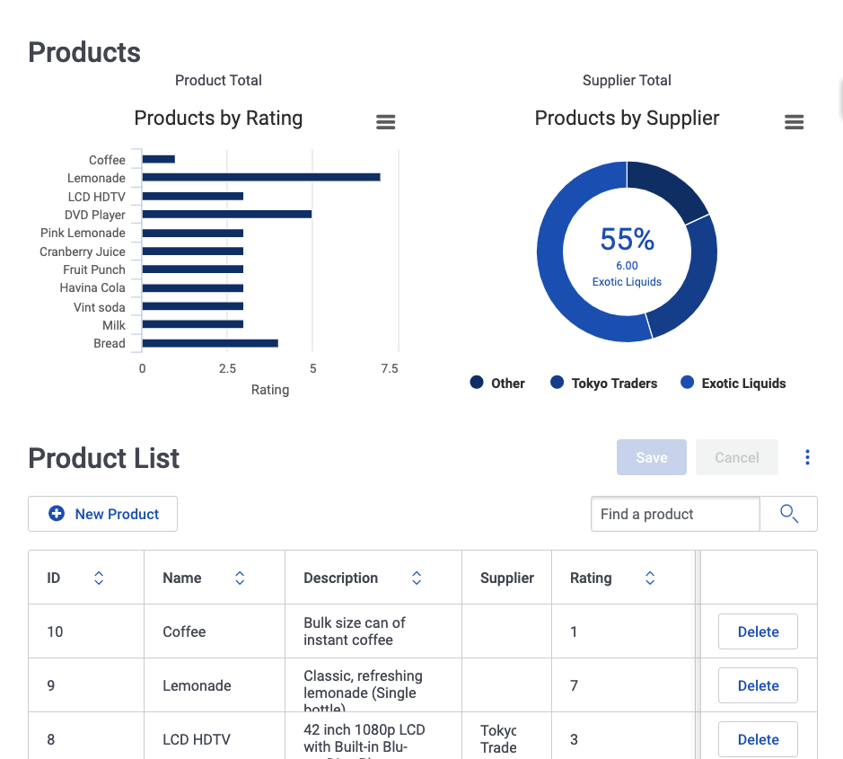

# Creating in-app guidance in Skuid with Shepherd

Hi! Cody, Skuid tech writer here. I've been dabbling in using in-app guidance tools alongside Skuid, and I got to experiment with a great library called Shepherd. Here's a quick look at what it looks like in a Skuid page:


Once you learn the basics, it's pretty intuitive to make tours for all kinds of sites and web apps! So while I'll be running through these steps from a Skuid-perspective, I'll do my best to keep the advice general enough to apply to any UI framework (or lack thereof) you may be using.

This report is going to try to go from concept to implementation, so I'll talk about the following

- How to analyze your app to outline a script
- How to best draft your scripts (Spoiler alert: It's Google Docs)
- How to prepare your Skuid page
- How to convert your script from prose to code

Since I'm trying to be thorough that's going to be… A lot of text. In light of that, here's a table of contents for hopping around this document:

[TOC]

Oh, and here's the XML if you're the type to start tinkering without reading the docs. (Speaking as a tech writer, _for shame_.)

With all that said, let's get started!

## What's Shepherd? {#what's-shepherd}

TL;DR: [Shepherd](https://shepherdjs.dev/) is an in-app guidance JavaScript library. But why use it instead of something else?

There's a lot of tools in the "in-app guidance" world—many of which focus on abstracting away code. That's excellent because low code tools help you iterate quickly to better help your users!  (_I am contractually obligated to say this as a Skuid employee. 😎👍_)

However, these tools often come with a price tag that can be hard to justify at first. In contrast, Shepherd is released under the [MIT license](https://github.com/shipshapecode/shepherd/blob/master/LICENSE)—meaning you can use it privately or commercially as long as you have the proper attribution. (`This is not legal advice, so double check with your own legal team!)`

Also if you want the control that code can give you, Shepherd is a great option. Some in-app guidance tools abstract away so much code, that you lose power. If code is anathema to you, it may be best to look elsewhere.

Speaking of code, let's talk about how Shepherd works. It parses a `Tour` object, which is made up of general options and step objects, i.e. you'll be writing a lot of JavaScript in JavaScript objects. Check out [the Shepherd website](https://shepherdjs.dev/) for all the docs, or read along for a full breakdown of my example below.

## The example page {#the-example-page}

The page I'll be writing a tour for is based on the Products page of the Skuid Sample Pages package, which uses the Northwind OData database. It displays some products and has a few nifty Skuid components for visualizations.

If you follow along with the example page I provided, there is one important thing to note: I've used an action sequence and some JavaScript to generate the page's data. That means you don't have to worry about setting up the Northwind data source just to try it out. Yay!

That doesn't impact the rest of this explanation, but if you had questions about where the data comes from, now you know. There's some other trickery there to make the data "work" but please, ignore the man behind the curtain.

## Scripting your tour {#scripting-your-tour}

#### Basic considerations {#basic-considerations}

_Quick sidenote before we begin: I know the prose of this example script is not 10/10 great, and it's not meant to be. It's for illustrative purposes_ 🙇

First, it's best to script out your guidance before even going to code. Run through your application, remember what the highlights are, and don't try and explain _everything_ with your tour. Focus on giving users ways to discover how to use your application by themselves. Unless you're teaching something complex, try to **keep your tour step count to single digits** and test that users can** complete the tour in only a few minutes**.

I like to imagine my tour scripts as a way to make explicit the connection between _user stories_ (i.e., what users should be able to accomplish with your app) and _UI elements_. It's similar to docs, but since you're in-app, you must adopt the user's perspective more directly.

(Side note: This is also why I like to embrace more casual language in in-app scripts. While docs are reference material, in-app guidance is a conversation.)

Also, knowing _how_ users enter your tour is an important thing to consider, so make that choice early and keep it in mind as you're writing. For this example, I'm just going to put a **help button** in the top right of the page. Users click this button, and the tour begins.

#### Deciding what to cover {#deciding-what-to-cover}

But enough philosophizing! Let's take a look at the page and make an outline.



There are several main elements / interactions I want to highlight for users:

- Hovering over items in the top-left bar graph displays more detail on products
- Hovering over the top-right donut chart segments displays more detail on suppliers
- Clicking a segment of the donut chart brings up a drilldown modal about the selected supplier's products
- Editing the detailed product data in the table updates the data displayed in the charts

Since it's usually best to keep tours short, I'd say these four bullet points represent the main points of the tour, with a few additional steps for more information about those features.

#### Script writing tips {#script-writing-tips}

I prepare my scripts in Google Docs, tweaking the text as I click through my app. I separate each step with horizontal lines (**Insert > Horizontal line** in GDocs), and I'll put any "stage directions" at the top of each step's section.

So something like this:

---

    <Pointing to the bar graph element>

    **Product Ratings**

    This graph displays product ratings as horizontal bars. This allows you to quickly parse how different products stack up against each other.

    This graph is also **responsive to data changes on this page**. If you edit a product's rating in the table below, this graph will automatically update to reflect the new rating.

---

    &lt;Pointing to donut chart element>

    **Next step title**

    Body text here…

This helps reviewers parse the document as individual steps instead of one big page of prose. **Which, by the way, have other people review and QA your work!** When script writing, it's easy to go on autopilot and not consider how each user may read your script or interact with the page, so get feedback early and often. Google Docs makes quick collaboration very easy, so try to have as many reviewers as you can.

After that work is done, and you have ✨ the script ✨ prepared, let's get down to business on prepping our Skuid page for our tour.

## The Skuid work {#the-skuid-work}

### Add unique IDs to elements {#add-unique-ids-to-elements}

Shepherd works by targeting DOM elements and using [the Popper.js library](https://popper.js.org/) to render step dialog boxes. While CSS class selectors can work, the best way to reliably target specific DOM elements is through **unique IDs**. This is great because, as a Skuid developer, you can apply unique IDs in _a lot_ of places.

Let's apply these unique IDs to the elements we noted in our outline above (Not sure how? Check the component doc links below for the **Unique ID** property):

- [Chart component 1](https://docs.skuid.com/latest/v2/en/skuid/components/ink/visualizations/chart/#advanced-tab): `products-by-rating`
- [Chart component 2](https://docs.skuid.com/latest/v2/en/skuid/components/ink/visualizations/chart/#advanced-tab): `products-by-supplier`
- [Table component](https://docs.skuid.com/latest/v2/en/skuid/components/ink/table/#display-tab): `product-list`
- [Chart drilldown modal](https://docs.skuid.com/latest/v2/en/skuid/components/ink/modal/#advanced-tab)`: supplier-drilldown`

We'll use these unique IDs in the Shepherd script code below.

### Add Shepherd to the Skuid page {#add-shepherd-to-the-skuid-page}

To utilize the Shepherd library, we'll need to make sure it's in the Skuid page. This is done via the JavaScript resources tab.

You could put the whole library inline, but I'm just going to use a CDN external resource.

1. Add [a new JavaScript resource](https://docs.skuid.com/latest/v2/en/skuid/javascript/resource-types/).
2. Set the following values:
    1. **Resource Type**: URL
    2. **Resource Name**: Shepherd
    3. **Resource URL**: `https://cdn.jsdelivr.net/npm/shepherd.js@8.1.0/dist/js/shepherd.js`

### Add some CSS rules for Shepherd's elements {#add-some-css-rules-for-shepherd's-elements}

So before we start I am also contractually obligated to say 🚨 **Do not use custom CSS in your Skuid pages.** 🚨  It is widely regarded as a very bad move, and it probably won't work. If you need to style your Skuid components, look at creating style variants in the Design System Studio, potentially [extending those style variants with JSS ](https://docs.skuid.com/latest/v2/en/skuid/design-system-studio/extend/) if need be.

Okay, now that that's out of the way:


This is a special case, because _we won't be styling our Skuid components_ with CSS—that's brittle and not great. Instead, we're just styling _Shepherd's dialog boxes_. In this case, we're tweaking them to fit more with Skuid's Ink design system.

We'll insert the rules through some` &lt;style> `tag hackery. You'll find my full CSS in the example page, but these are the basics:

1. Drag and drop a Text component into the canvas.
2. In the Advanced tab, enable **Allow HTML.**
3. In the newly available **HTML** field, enter your CSS:

```html
<style type="text/css">
   .shepherd-element {
       min-width: 352px;
    max-width: 500px;
       box-sizing: border-box;
       border-radius: 3px;
       background-color: #fff;
       font-family: Roboto, Helvetica, sans-serif;
       box-shadow: 0 7px 6px 0 rgba(0, 0, 0, .23), 0 3px 6px 0 rgba(0, 0, 0, .16);
       background-color: #fff;
       z-index: 9999;
   }

   /* Other CSS rules here*/
</style>
```

## From script to code {#from-script-to-code}

Now that our Skuid page is ready, we can start translating the script into JavaScript code for Shepherd.

You'll see the full JavaScript script (_let's try to say script a few more times)_ in the example page,  but I'll cover the broad strokes.

### Setting up common references {#setting-up-common-references}

#### Elements {#elements}

I like to set a sort of "element reference" at the top of my scripts:

```javascript
// Element reference
const productsByRating = "#products-by-rating",
   productsBySupplier = "#products-by-supplier",
   productList = "#product-list",
   drilldownProductList = "#drilldown-product-list",
   supplierDrilldown = '#supplier-drilldown div[role="dialog"]'
```

Doing things this way, if you need to adjust a step's target selector, you can just update the reference at the top of your script instead of digging into more deeply nested code.

It's also possible to use complex CSS selectors or even JavaScript functions to target elements. For some practice, let's pretend we can't target the charts as easily. How else could we target them for their respective steps?

Check this out:

```javascript
// Element reference
const productsByRating = document.querySelectorAll('div[data-te="skuid__chart"]')[0],
   productsBySupplier = document.querySelectorAll('div[data-te="skuid__chart"]')[1],
   productList = "#product-list",
   drilldownProductList = "#drilldown-product-list",
   supplierDrilldown = '#supplier-drilldown div[role="dialog"]'
```

Here we get _all_ Skuid charts in the page with `querySelectorAll()`, then pinpoint the chart we want using the appropriate index. We know the `productsByRating` chart comes first, so `querySelectorAll(<selector>)[0]` does the job.

So, while using unique IDs is best practice—and the most reliable—method of targeting elements, sometimes you may need more dynamic behavior.

**A word of warning though: Using document.querySelector() for elements that do not exist at the start of the tour causes problems!** Using selector strings means that Shepherd tries to find the element _only when_ the step renders—this is particularly important if your tour steps make certain elements appear, like dialog modals or menus. If the element doesn't exist at the start of the tour, Shepherd won't have a proper reference.

Try to stick to selector strings unless your needs are more complex.

##### Complexity in action: What about those donut chart segments? {#complexity-in-action-what-about-those-donut-chart-segments}

You'll most likely resort to complex selectors when working with Skuid subcomponents or component elements. For example, I've outlined that I want a step highlighting the on-click action for my donut chart. So how do I target a specific segment of the Chart component?

Time to jump into your browser's Inspector tool and use a nested query selector. Get ready for a busy looking screenshot!:


Let's break down what's going on in that screenshot:

- I'm using the Inspector tool to target a segment of the donut chart.
- Since I'm inspecting a segment, I can see its element type (`path`) and its CSS classes in the **Elements** section. With these two things, I can write a decent selector: `path.highcarts-point`
- However, that's not specific since there are multiple Chart components. So, in the Console, I'm writing a query selector statement that's nested within my declared `productsBySupplier `element—that way I only get segments within the component I want.

With all of that, I can create a reference to these specific segments!

```javascript
let donutChartSegments = productsBySupplier.querySelectorAll('path.highcharts-point');
```

Since this is an array, I need to use an index position to specifically target one in my step code later on, e.g. `donutChartSegments[2]`.

#### Button patterns {#button-patterns}

Each Shepherd step can display navigation buttons (e.g. _Next_ and _Previous_) by declaring a `buttons` array. This array contains an object for each button. I won't go into details about how to build buttons (check [the Shepherd docs](https://shepherdjs.dev/docs/Step.html#Step) for that information), but I'd like to talk about some general things.

Like element targets, and in keeping with the spirit of _Don't repeat yourself_, I like to define my buttons at the top of my scripts instead of copy/pasting them to each step. So you'll see this at the top of my script code:

```javascript
const previousButton = {
   classes: "shepherd-button-secondary",
   text: "Previous",
   action() {
       return Shepherd.activeTour.back();
   }
},
const nextButton = {
   text: "Next",
   action() {
       return Shepherd.activeTour.next();
   }
}
```

### Creating a tour and its options {#creating-a-tour-and-its-options}

When creating the `Tour` object, you can set some useful defaults:

```javascript
const tour = new Shepherd.Tour({
   useModalOverlay: true,
   confirmCancel: true,
   confirmCancelMessage: "Are you sure you want to exit the tour?",
   keyboardNavigation: false,
   // These options apply to each step in the tour, but it's also possible to overwrite them.
   defaultStepOptions: {
       cancelIcon: {
           enabled: true
       },
       scrollTo: { behavior: "smooth", block: "center" },
       // Let's set a small offset so dialog boxes don't appear right on top of elements.
       // This is done by setting options for Popper, the library Shepherd uses for generating popups.
       popperOptions: {
           modifiers: [{ name: 'offset', options: { offset: [0, 16] } }]
       }
   }
});
```

I won't go through every option possible ([see Shepherd docs for that](https://shepherdjs.dev/docs/Tour.html)), but I'll run through the highlights:

- `useModalOverlay`: Setting this to true dims the rest of the screen _except_ for your targeted element. This is really great for guiding users' attention. The only caveat is **the overlay must remain on or off for the entire tour.** Or at least, there's no out-of-the-box option to turn it off mid-tour. So if on one step you want the whole screen visible, undarkened, you'll need to get a little crafty with your code.
- `confirmCancel` and `confirmCancelMessage`: Without these settings, users can just click out of and exit your tour accidentally. Enabling this prompts the user to confirm before quitting with a custom message. Highly recommended.
- `keyboardNavigation`: This setting is _not_ essential most of the time, but if you have a step that requires users interact with the page, I recommend setting this to <code>false<em>.</em></code> Otherwise users can just use an arrow key to proceed to the next step.
- <code>defaultStepOptions</code>: All steps added to this tour <em>inherit</em> all [step options](https://shepherdjs.dev/docs/Step.html) set here. This is great for setting up things you know are relevant throughout the tour. For example, I'm always going to want my cancel button visible on each step—so I set it in the default step options.

### Coding individual steps {#coding-individual-steps}

Steps are where a lot of logic happens, and more complicated steps can look intimidating until you understand how to write/read them.

First, let's look at a step's code beside the dialog box it generates:

<table>
  <tr>
   <td><code>{</code>
<p>
<code>       title: "Product ratings",</code>
<p>
<code>       text: `&lt;p>This graph displays product ratings as horizontal bars. This allows you to quickly parse how different products stack up against each other.&lt;/p></code>
<p>
<code>           &lt;p>This graph is also interactive. If you edit a product's rating in the table below, this graph will automatically update to reflect the latest rating.&lt;/p>`,</code>
<p>
<code>       attachTo: {</code>
<p>
<code>           element: productsByRating,</code>
<p>
<code>           on: "right"</code>
<p>
<code>       },</code>
<p>
<code>       buttons: [previousButton, nextButton]</code>
<p>
<code>   }</code>
   </td>
  </tr>
  <tr>
   <td>


   </td>
  </tr>
</table>

Pretty cool right? Let's break down each part of that step so we can script the rest of our tour. From there, I'll talk about some additional step attributes you can set for more complex interactions—like requiring a user to interact with an element before advancing.

#### Text and text styling {#text-and-text-styling}

Shepherd can accept HTML within each step's text. You ideally won't need much markup, but if you need line breaks, emphasized text, or images, you'll need HTML. That's why it's best to use [template literals](https://developer.mozilla.org/en-US/docs/Web/JavaScript/Reference/Template_literals), which are much more flexible in terms of writing strings in JavaScript.

In our example step we only need basic HTML: two line breaks. We'll surround these paragraphs with the `&lt;p>` tag so they render properly, otherwise the entire step text will be on one line:

```javascript
   {
       title: "Product ratings",
       text: `<p>This graph displays product ratings as horizontal bars. This allows you to quickly parse how different products stack up against each other.</p> <p>This graph is also interactive. If you edit a product's rating in the table below, this graph will automatically update to reflect the latest rating.<p>`,
   }
```

#### Targets and the attachTo attribute {#targets-and-the-attachto-attribute}

Shepherd steps can attach to individual DOM elements with the `attachTo` attribute. This causes the dialog box to point directly to the element instead of just appearing in the center of the screen—which is super useful for explaining specific UI elements to your users. This is also why setting those unique IDs was so important earlier.

```javascript
       attachTo: {
           element: productsByRating,
           on: "right"
         }
```

You'll notice that `attachTo` is an object, where we provide both an element and the direction the dialog box should appear on. I like to make sure my step dialogs appear _over_ elements not mentioned in the current step.

For example, I'm intentionally covering the product supplier donut chart in this step so the user is gradually introduced to the app's UI instead of being confronted with every chart at once.

#### Step buttons {#step-buttons}

Since we clarified our buttons early in the script, we can just enter a readable array of the buttons we want:

```javascript
       buttons: [previousButton, nextButton]
```

#### Advancing when an element is clicked {#advancing-when-an-element-is-clicked}

With that step broken down, let's talk about a more advanced one: targeting a chart segment and instructing users to click it to open the "drilldown" modal."

To do this we'll need to build on all of the previous sections to target a subelement, only use one button pattern, and advance when that step's element is clicked.

To do those three things we'll need to make sure to:

- Disable keyboard navigation in the tour options
- Only display the `previousButton` in the `buttons `array
- Set an event listener on the targeted chart segment to progress the tour

So what does the step code look like?

```javascript
   {
       title: "Supplier information",
       text: "This chart also allows you to click individual segments for more information about the products that comprise it.<br\> Click this segment to see an example.",
       attachTo: {
           element: donutChartSegments[2],
           on: "left"
       },
       when: {
           show: () => {
               donutChartSegments[2].addEventListener('click', () => {
                   Shepherd.activeTour.next();
               }, { once: true })
           }
       },
       buttons: [previousButton]
   },
```

So, per the instructions, I want users to click the element to proceed. Shepherd does have an `advanceOn` step property,  but it's finicky and [even the library's authors don't endorse its use.](https://github.com/shipshapecode/shepherd/issues/511#issuecomment-520810849) I find it's easier to just skip the troubleshooting and put a one-time event listener on the element using a function in the `when` property on the `show` event. Now the user **must** click the element to continue (again, assuming you set `keyboardNavigation` to false in the tour options.

(As a side-note, [{once:true} on addEventListener](https://developer.mozilla.org/en-US/docs/Web/API/EventTarget/addEventListener#Browser_compatibility) won't work on IE11. But if you have to support IE11, you're probably already enough of a wizard to know the workarounds.)

As a general rule, if you have other logic you need for a particular step, don't forget about the `when` property.

#### My element doesn't exist yet! {#my-element-doesn't-exist-yet}

One thing that can be challenging with in-app content for more dynamic apps is, well, sometimes things don't _exist_ at the right time!

While using selector strings in our element reference _does_ mitigate this issue for the most part, sometimes you'll have stubborn elements that take a few extra milliseconds to load.

How you handle this is a bit of a choose-your-own-adventure story. First, you have two options on _where_ you put your logic:

- You can choose to _not_ progress to the next step until the element exists. This means placing the logic in our `when.show` function above.
- You can also use a [beforeShowPromise](https://shepherdjs.dev/docs/Step.html) on the step that needs to wait for the element. This means the step won't render until the promise you set here is resolved. I chose this method for this example.

And as for the waiting-for-element logic, you also have a few options:

- Using [setTimeout](https://developer.mozilla.org/en-US/docs/Web/API/WindowOrWorkerGlobalScope/setTimeout) logic, you can check for an element's existence in a loop until it does exist.
- You can use the [MutationObserver](https://developer.mozilla.org/en-US/docs/Web/API/MutationObserver) API for a nuanced system in terms of waiting for elements or changes to elements.

Or you can be truly lazy like my example and just wait 400 milliseconds:

```javascript
   {
       title: "Supplier segments",
       text: `This modal shows which products are filed under the segment you clicked in the chart.`,
       attachTo: {
           element: supplierDrilldown,
           on: "bottom"
       },
       // Skuid needs a moment to render the dialog modal.
       // This isn't the most graceful way to wait for it,
       // but it works for our example.
       beforeShowPromise: function () {
           return new Promise(function (resolve) {
               setTimeout(function () {
                   resolve();
               }, 400);
           });
       },
       buttons: [nextButton]
   }
```

**Obligatory "this is not best practice" warning.** I would recommend coding a much more exhaustive check for the element. But for now, just consider this a lesson on iteration—it works, now make it better!

## Including and activating your tour in the page {#including-and-activating-your-tour-in-the-page}

Now that we're writing script code, let's implement it within our page so we can test it as we write. Do all of the following from the App Composer:

1. [Add a new JavaScript resource.](https://docs.skuid.com/latest/v2/en/skuid/javascript/resource-types/#adding-resources)
2. Set the following values:
    *   **Resource Type**: Generic JS snippet
    *   **Resource Name**: Unless you have more than one tour for the page, no need for a complex name, _tour_ or _pageTour_
    *   **Snippet body**: Paste your tour's code here

And that's pretty much it! We're using a **Generic JS snippet** resource type so we can activate this tour from the Action Framework.

Speaking of which, let's create that Help button:

1. Drag and drop a new **Button Set** component to the top of the page canvas.
2. Click **Add button group**.
3. Click on the default button within that new group.
4. Update its **Basic** properties:
    1. **Button label**: Make this blank, or optionally _Help_.
    2. **Button icon**: sk-webicon-ink:help

Now, add the actions to activate the tour:

1. With the button selected, click the **Actions** tab in the Properties pane.
2. Click **+ Add Action**.
3. Set the action's properties:
    1. **Action type**: Run JavaScript snippet
    2. **Name of snippet to run**: The name of the snippet you created above, e.g. _tour_.
4. Click **Save.**

And with that, your tour can be activated with the click of a button! I recommend doing this early in the coding process so you can test out your tour as you code it. Which brings me to...

## Iterating on your tour {#iterating-on-your-tour}

All right, so those are the basics of turning your written script into a coded script. I've covered the biggest things, so I won't go through that translation process for each step. However, I'll give one last piece of advice: **test early and often.**

I often have the App Composer open in one window with a page preview open in another, splitting my screen real estate between the two. Then it's just a matter of _make a tweak, save, refresh, repeat ad nauseum_. You'll find yourself making a lot of little UX choices while doing this, because it helps keep you focused on the viewpoint of the user—and the whole point is to make their lives easier, right?

## User testing {#user-testing}

Once you've got the tour to a satisfactory place, put it in front of users! But don't just hit the big red Deploy button yet!

Get some trusted internal stakeholders—both people who have proofread your script and those who have never seen it before—to try your tour. If possible, ask if you can watch them as they do (maybe even record their screen) and do your best to _not guide their experience_.

Often you'll find really interesting user behaviors you wouldn't have otherwise just by watching. After you gather their initial feedback,_ then_ ask them questions about choices they've made. Many times users won't even realize they did something you have questions, and those little interactions are where some of the best UX improvements can be discovered.

What you'll likely find during this stage is that certain steps need to be divided up into other, smaller steps, or maybe the information that's attached to one element would be better displayed as a central modal, unconnected to anything. Since your script is written as JavaScript, it's pretty easy to comment out things, like element selectors, so that you can test which works best. Don't be afraid to make small adjustments and (if you haven't annoyed them enough) ask your users to go through the tour again.  \

Take each suggestion, weigh it against the goal of the tour, and iterate often!

## Deploy and call it a day {#deploy-and-call-it-a-day}

Once you've iterated on your tour through your own testing _and_ user feedback, it's probably ready for primetime! Deploy your Skuid page (or publish your website if you've been doing this outside the context of Skuid) and take a break!

Your work likely isn't over though. You'll hear more and more ideas and suggestions as your work rolls out to more people. Always be willing to hear out your users, and see if you can find ways to make your tour more informative, more concise, and more engaging.

Remember, be like Tron:


# Additional resources {#additional-resources}

There's a lot of great resources on how to best design and style your in-app guidance. You'll see this concept referred to in a few ways: in-app guidance, guided tours, etc. Here are some other resources to check out:

- [Meghan Mahar's in-app guidance presentation at Write the Docs Portland](https://www.writethedocs.org/videos/portland/2019/tutorials-tooltips-and-popupsoh-my-how-to-ease-yourself-and-your-users-into-in-app-messaging-meghan-mahar/): I think this presentation communicates a lot of the more conceptual aspects of in-app guidance really well, and she also talks about getting buy-in from your team. I wanted this blog post to show you a quick technical example, but this presentation discusses broader design ideas that'll make your guidance more excellent.
- [Salesforce's in-app guidance page](https://help.salesforce.com/articleView?id=customhelp_lex_prompt_example.htm&type=5): This provides some good tips on writing engaging tour content and how to format that content.
- [Intuit's Content Design guide on Guided tours](https://contentdesign.intuit.com/content-patterns/guided-tours/): A concise little reference with good basic tips to keep in mind.
