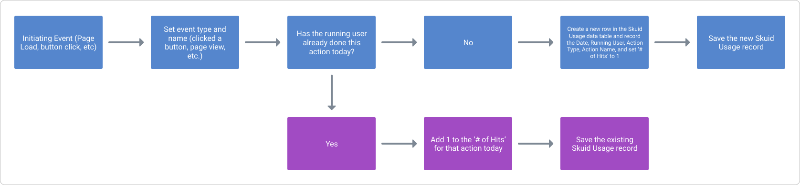

# Lab Report: Building a simple analytics tracker with an action sequence

- [Assumptions](#assumptions)
- [Sample XML](#sample-xml)
- [The Usage Snapshot Action Sequence: An Overview](#the-usage-snapshot-action-sequence-an-overview)
- [Build Steps](#build-steps)
  - [Step 1: Create a new object/entity to contain the collected usage data](#step-1-create-a-new-objectentity-to-contain-the-collected-usage-data)
  - [Step 2: Configure the fields on the new object to capture the desired data](#step-2-configure-the-fields-on-the-new-object-to-capture-the-desired-data)
  - [Step 3: Create a 'Skuid_Usage' model on your page or master page](#step-3-create-a-skuid_usage-model-on-your-page-or-master-page)
  - [Step 4: Create a 'Usage Snapshot' action sequence](#step-4-create-a-usage-snapshot-action-sequence)
  - [Step 5: Using the Usage Snapshot](#step-5-using-the-usage-snapshot)
    - [Example 1: Tracking page views actions](#example-1-tracking-page-views-actions)
    - [Example 2: Tracking a button click action](#example-2-tracking-a-button-click-action)

## Assumptions

- **Note**: This Lab Report is for Skuid users that know how to:
  - Create custom objects and custom fields in Salesforce.
  - Setup a Skuid page with a functioning model.
  - Create action sequences using Skuid's Action Framework.

The following experiment is written using Skuid with Salesforce as a data source. However, the underlying concepts are transferable to Skuid applications using different external data systems.

## Sample XML

See the sample XML used for the Usage Snapshot action sequence here: [Skuid_Usage.xml](Skuid_Usage.xml)

## The Usage Snapshot Action Sequence: An Overview

Basic flow of the usage tracking action

Action sequences are incredibly powerful tools that allow builders to create and reuse a particular set of actions from page to page. And because of this functionality, we can create a relatively simple action sequence that will allow us to create usage metric records for use with analytics. 

The action sequence we're about to build is best for capturing valuable insights from questions like these:

- _Who did what?_
- _When did they do it?_
- _How many times have/did they do it?_

These data points are the foundation for gathering insights on page usage and performance. See the charts below for examples of how to use this data:

Area chart displaying the total number of 'Hits' per day on Skuid Usage records created from a page load action, broken out by page name.

Column chart displaying the number of unique users that have viewed a tracked Skuid page in the past 30 days.

With this relatively simple action sequence, and the data it collects, you can create intuitive aggregate models to assess the usage of Skuid across your organization. 

## Build Steps

### Step 1: Create a new object/entity to contain the collected usage data

First create a custom object. To follow along with this example name it _Skuid_Usage._ To create this object, [see Salesforce's documentation](https://help.salesforce.com/articleView?id=dev_objectcreate_task_parent.htm&type=5).

### Step 2: Configure the fields on the new object to capture the desired data 

- **Note**
  - If you created a custom object in Salesforce, most of the usage tracking functionality can leverage default fields on a custom object, like _Last Activity Date_ and _Owner_. 
  - If you want to avoid creating extra fields, you can use the standard _Name_ field on the custom object and rename it.

With the object created, let's adjust the object's **Name field,** which we'll use as a **text** field to capture the name of the Skuid page where the tracked action is taking place. For readability, update this field to be named **Page Name.**

The following two fields, which are automatically populated by Salesforce, will also be useful for analytics tracking:

1. **CreatedById**: A **lookup relationship** field that will reference the User object, tying the Skuid Usage record to the user that performed the tracked action.
1. **Created Date**: A **date/time** field that will capture a timestamp of when the Skuid Usage record was created.

**Note**: If you'll be recreating this functionality on your own data source, you'll need to recreate these fields and update them in the action sequence below.

Next, [create the following fields](https://help.salesforce.com/articleView?id=adding_fields.htm&type=5) to track additional information:

1. **Tracked Action Category**: A **text** field to capture the _categories_ of actions you'll be tracking. You can alternatively make this a **picklist** field if you wish to only use a specific set of values. Some example values for this field include:
    - Page View
    - Button Action
    - Filter Activated
2. **Tracked Action Name**: A **text** field to capture the value of the particular action being tracked. This field will track more specific information like _Which button was the user clicking?_ or _Which type of filter were they activating?_

### Step 3: Create a 'Skuid_Usage' model on your page or master page

Navigate to the page that you wish to add analytics to, or [create a new master page](https://docs.skuid.com/latest/en/skuid/pages/master-child-pages.html#create-a-master-page) to be reused across multiple child pages.

- **Note**: It's recommended to create the 'Skuid_Usage' model on a master page, because it will always be available on any connected child pages, and you won't have to create the same model on every page in which you are tracking actions.

Configure the following model properties (any other properties can use their default values):

- **Model Id**: Skuid_Usage
- **Data Source Type**: Salesforce
- **Data Source**: Salesforce
- **Salesforce Object Name**: Skuid_Usage__c
- **Query on Page Load**: False
- **Max ## of records**: 1 

Then add the following model fields:

- Name (or _Page Name_ if you renamed the field)
- Tracked_Action_Category__c
- Tracked_Action_Name__c

### Step 4: Create a 'Usage Snapshot' action sequence

Next, [create a reusable action sequence](https://docs.skuid.com/latest/en/skuid/action-framework/action-sequences/#reusable-action-sequences) on your page and name it something like 'Usage Snapshot'. **This action sequence is what will be used to create the analytics records.** By setting up inputs, you can reuse this sequence anywhere you wish to record a tracked action.

- **Note**: Similar to what we did with the Skuid_Usage model, it's best to add this action sequence to your master page. That way this action sequence will be available to use on every child page. 

First, configure the basic information for the action sequence:

- **Type**: Reusable Action Sequence
- **Sequence Name**: Usage Snapshot

You can also add a _description_ if needed.

Next, click **the Inputs tab** and add the following inputs: 

1. An input to record the tracked action category
   - **Name**: trackedActionCategory
   - **Type**: Value
2. An input to record the tracked action name
   - **Name**: trackedActionName
   - **Type**: Value

Now return to the Actions tab to create the sequence by adding the following actions (any action properties not listed below can use their default values):

- **Action 1**: Remove all rows from Model
  - **Models to Empty**: Skuid_Usage
- **Action 2**: Create new row(s)
  - **Model**: Skuid_Usage
    - **Update Field 1**: Record the category of action
      - **Field**: Tracked_Action_Category__c
      - **Field Value Source**: Single Specified Value
      - **Value**: {{$Input.trackedActionCategory}}
    - **Update Field 2**: Record the specific action
      - **Field**: Tracked_Action_Name__c
      - **Field Value Source**: Single Specified Value
      - **Value**: {{$Input.trackedActionName}}
    - **Update Field 3**: Records the page name where the action happened.
      - **Field**: Name _or_ Page Name
      - **Field Value Source**: Page/URL parameter value
      - **Parameter**: page
- **Action 3**: Save Model changes
  - **Models to save**: Skuid_Usage

### Step 5: Using the Usage Snapshot

Use the _Usage Snapshot_ action sequence in tandem with the action you would like to track. 

See the examples below for some initial ideas. 

#### Example 1: Tracking page views actions

Create the following action sequence to track page views using the Usage Snapshot action:

Use these basic properties:

- **Type**: Event-triggered sequence
- **Sequence Name**: Track page view
- **Event Name**: Skuid Page: Rendered

Add one action to the sequence:

- **Action Type**: Run Action Sequence
- **Action Sequence**: Usage Snapshot
- **trackedActionCategory**: Page View
- **trackedActionName**: Page View

#### Example 2: Tracking a button click action

You can also use the usage snapshot within a button's set of actions to track how often that button is used. Run the _Usage Snapshot_ sequence at the end of the button's standard list of actions to do so. 

For example, if you had a click-to-dial button on an accounts page, that action may have the following properties:

- **Action Type**: Run Action Sequence
- **Action Sequence**: Usage Snapshot
- **trackedActionCategory:** Button Action
- **trackedActionName:** Click-to-dial